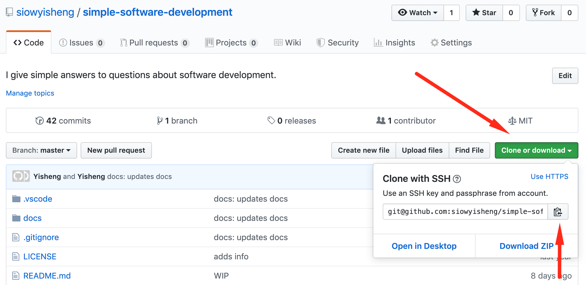

Simple Git
******************

Overview
---------
Git (`install <https://git-scm.com/downloads>`_) is a *version control system* found everywhere in software
development. It is often used from the command line.

.. .. image:: https://juristr.com/blog/assets/imgs/git-clean-history.gif
..     :width: 450px
..     :align: center
..     :alt: git demo

Software often lives in multiple *versions* at once. At least one
stable version and a version for each new feature or bug fix.

Versions are also called **branches**. Changes to branches are saved
as **commits**, which are like checkpoints, and the entire project folder is a
**repository**/**repo**. Repos on your computer are **local**. Repos
living on github are **remote**. The initial (and usually main) branch of a
repo is often called **master**.

Git allows us to:

* make a local copy of a remote repo
* sync the local repo with the remote repo
* merge branches
* create new branches from existing branches
* switch quickly between branches
* store branches together in one folder
* view commit history
* compare two commits

Git repositories are most often uploaded to `Github <https://github.com/>`_
where they can be public or private.

Github is a place where a lot of software is hosted. Many developers make their
source code publicly visible, which allows anybody to write edits and requests
for their edits to be accepted, which are called **pull requests**.

Basic usage
-----------

Create a repo
==============

Create your new repository on `github`.

Make a local copy of a github repo
==================================

Find the address to clone here.



Then do::

    $ git clone git@github.com:siowyisheng/simple-software-development.git

A folder will then be created in the folder where you did the command.

Check the status of your local repo
===================================

::

    $ git status

This shows useful information, including changes which have not been *added*
and changes which have not been committed, as well as the status of the
commits of the local repo versus the commits of the local copy of the
remote repo.

Make a commit
===============

First, we **add** the files that we want to commit::

    # this adds all changed files
    $ git add .

    # this adds one changed file
    $ git add my_file.py

    # this adds all changed files within a folder
    $ git add my_folder

Then::

    $ git commit -m 'feat: adds commenting feature'

.. note:: The part within the quotes is the **commit message**, which is important for logging. One best practice is to use `semantic commits <https://seesparkbox.com/foundry/semantic_commit_messages>`_.

For a longer commit message::

    $ git commit

This brings you to a text editor within your shell to input
your commit message. End the commit message with ``esc, Z, Z``.

Push local changes to a remote repo
===================================

To update the remote repo with your local commits::

    $ git push

This could fail if the remote repo has extra commits
compared to your local repo, which could be caused by (A) your
teammates pushing changes, or (B) if you intentionally removed
some commits on your local repo.

In situation (A), we need to `pull the changes from remote <#pull-changes-from-remote>`_.

In situation (B), we can use::

    $ git push --force-with-lease

.. warning:: It could also fail if you don't have push permission, in which case you should make a pull request.

Pull changes from remote
=========================

To update the local repo with changes from the remote::

    $ git pull

You may need to `resolve merge conflicts`_.


Create a branch
===============

To create a new branch, first `switch to the branch <#switch-to-a-branch>`_ that you want base off of, then::

    $ git checkout -b my_branch_name

Switch to a branch
==================

::

    $ git checkout my_target_branch

Merge a branch into master
==========================

First `switch to the master branch <#switch-to-a-branch>`_::

    $ git merge my_branch_to_merge

Resolve merge conflicts
========================

Merge conflicts can happen when updating the local repo, either
through ``git pull`` or ``git stash pop``. This happens when
multiple commits touch the same lines of code and git does not
know which commit to follow.

When git notifies you of a merge conflict, you can open the file
with the merge conflict in vscode and look for something like::

    <<<<<<< Updated upstream
    some code edited to A
    =======
    some code edited to B
    >>>>>>> Stashed/Incoming changes

Then analyse the code and delete the unwanted code. Back in the
command line::

    $ git add file_with_merge_conflict

View commit history
===================

::

    $ git log --oneline

Or with more details::

    $ git log


Compare two commits
===================

::

    git diff base_commit_reference new_commit_reference

A commit reference can be:

* a partial commit hash like ``1fc2cd7``, which you can find from the `commit history <#view-commit-history>`_,
* ``HEAD``, which is a reference to the last commit in the current branch
* a branch name like ``master``, which points to the latest commit in that branch

.. note::  A commit ref can also have a suffix like ``~1``, which means 1 commit *before* that commit.

Example to compare the second last commit with the latest commit::

    $ git diff HEAD~1 HEAD

More usage
-----------

TODO:

Best practices
---------------------------

Make focused commits and include the commit type in the commit message::

    feat: adds some new feature
    fix: fixes some bug
    content: changes some values/strings/content only (no actual code change)
    test: adds tests
    refactor: refactors some section
    docs: changes some documentation
    chore: updates build (no code change)
    perf: improves performance of some section (by refactoring)
    style: formats some section

## How do remotes repositories work?

A remote repository first exists at a remote location; often, a github repo.
When you `git clone` the repo, you create a **local copy** of the repo and the
branches which **track** the remote repo's branches. You also create a
**reference** to the remote repo and its branches.

## What is the difference between `git fetch` and `git pull`?

`git fetch` accesses the remote repo and updates your **reference** to the remote repo. `git pull` does a `git fetch` and also does a `git merge` to merge your reference to the remote branch with your local copy of the remote branch.

See [above](#how-do-remotes-repositories-work) to understand how remote repositories work.

## What are some common commands?

`git diff HEAD~1 HEAD` - View differences between this commit and the previous.

## How do I track the history of a file?

`gitk (filename)` or `git log -p (filename)`.


## How do I overwrite the remote after making a mistake?

`git push --force`

## How do I reset my local branch to copy the remote?

`git reset --hard origin/(your_branch_name)`

## How do I find a commit by the message?

`git log --all --grep='your search string'`

## How do I delete a local branch?

`git branch -D branch_name`

## How do I remove references to branches on the remote?

`git fetch --prune`

## How do I move recent commits to a new branch?

Scenario: You made 5 commits to `master` although you were supposed to work on a new branch.

```bash
git branch newbranch
git reset --hard HEAD~5
git checkout newbranch
```

## How do I check which files were edited between two commits?

`git diff --name-only HEAD~1 HEAD`

## How do I stash just one or a few files?

```bash
git stash save -p
```

From there, use:

- `a` to add the file to the stash
- `d` to ignore the file
- `q` to ignore the rest of the files

## How do I see changes of all recent commits?

```bash
git log -p
```

## How do I see an overview of what recent commits touched?

```bash
git log --stat
```

## How do I amend my last commit message?

```bash
git commit --amend
```

## How do I add a file to a commit?

```bash
git commit -m 'initial commit'
git add forgotten_file
git commit --amend
```

## How do I find all commits that added or removed a certain string?

```bash
git log -S "dude, where's my car?" --source --all
git log -G "^(\s)*function foo[(][)](\s)*{$" --source --all
```

## How do I list all files which were changed between two commits?

```bash
git log --name-only --pretty=oneline --full-index 0be8c001..HEAD | grep -vE '^[0-9a-f]{40} ' | sort | uniq
```

## How do I checkout just one file from a previous commit?

```bash
git checkout c5f567 -- file1/to/restore
```


git blame
